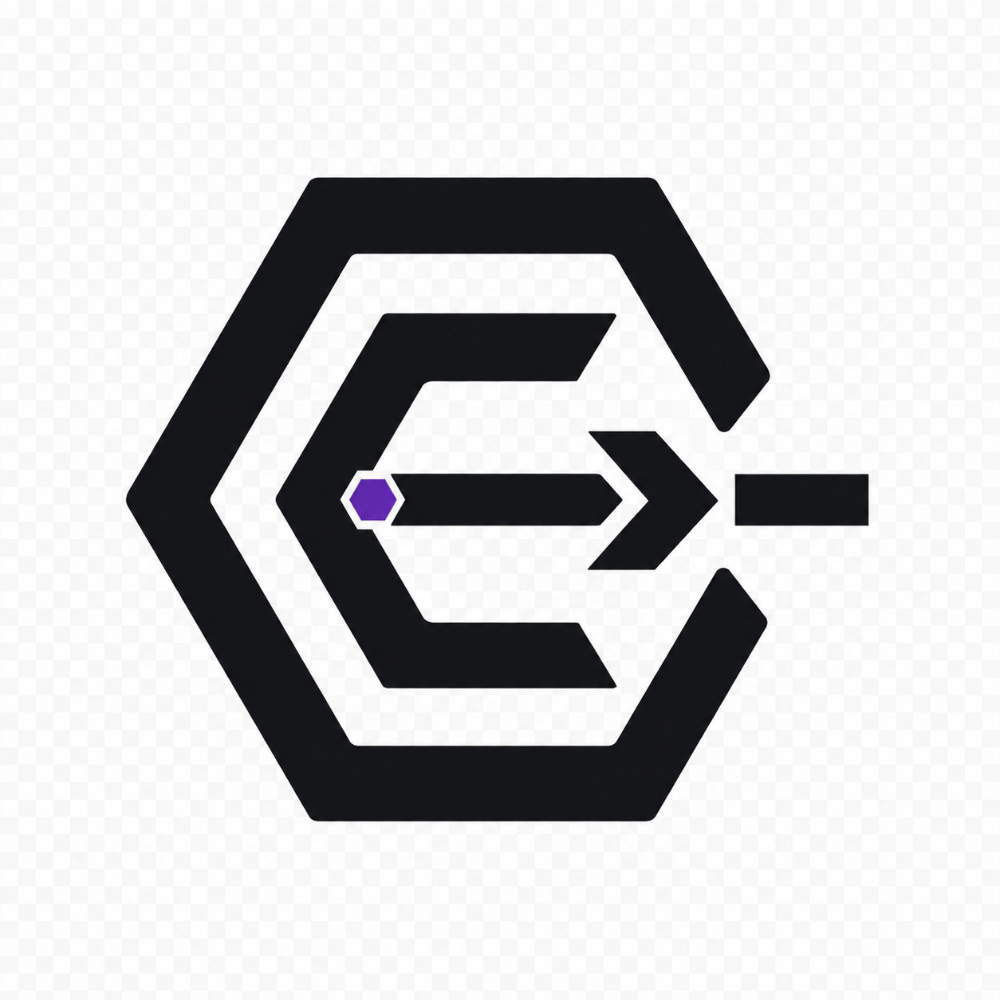
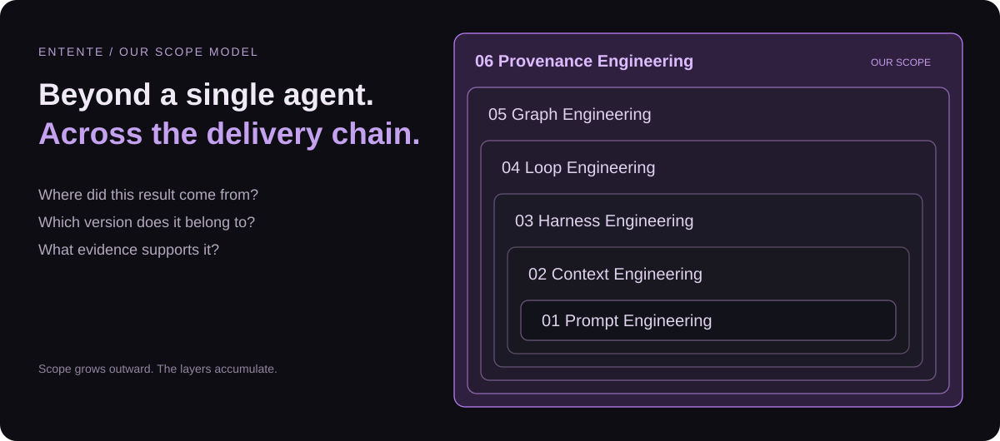
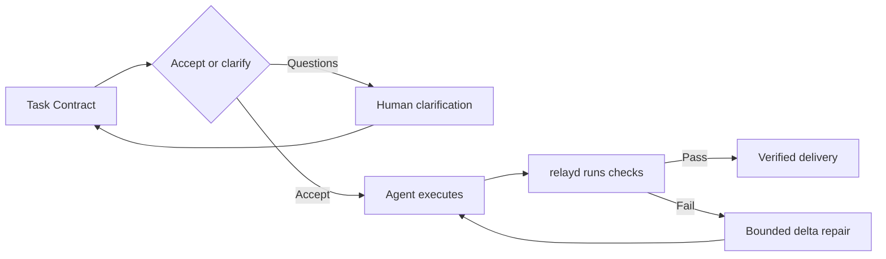

<p align="center">
  
</p>

<h1 align="center">Entente</h1>
<p align="center"><strong>Provenance Engineering for Agent Teams</strong><br />Every handoff carries a contract. Every result carries evidence.</p>
<p align="center">
  <a href="LICENSE"></a>
  
  
</p>
<p align="center">
  <a href="https://entente-provenance.test831.chatgpt.site">Interactive hackathon report</a> ·
  <a href="#quick-start-no-agent-or-api-key">Quick start</a> ·
  <a href="#how-to-contribute">How to contribute</a> ·
  <a href="https://github.com/allenchenhan99/entente/issues">Design discussions</a>
</p>

**Turn ambiguous handoffs between coding agents into scoped, verifiable work.** Entente's coordination core, **RelayGraph**, runs above agent runtimes such as Claude Code and Codex. It defines what must be delivered, checks the evidence, and requests targeted repair when a criterion fails.

- **Clarify before execution** — the recipient accepts a Task Contract or asks material questions before starting work.
- **Check evidence, not just status** — relayd runs declared checks in the task worktree and records mismatches with the agent's self-report.
- **Repair the failed task** — a delta repair identifies the failed criteria and requested corrections, with an explicit repair budget.
- **Keep the delivery history** — contracts, checks, human decisions, and repairs become JSONL events that drive state, graph, and replay.

Built at the FUTUREMODE BUILDMODE Gen-AI Hackathon 2026.

## Our scope: from prompts to provenance



We propose **Provenance Engineering** as Entente's outermost scope: preserving where decisions and results came from, which version they concern, what verified them, and whether that evidence still applies. This is our product framing; the layers accumulate rather than replace one another.

| Scope, small → large | The question it addresses |
| --- | --- |
| Prompt Engineering | How do we express this instruction? |
| Context Engineering | What information does the agent need? |
| Harness Engineering | Which tools, permissions, and environment support one agent? |
| Loop Engineering | How does a task execute, receive feedback, repair, and stop? |
| Graph Engineering | How do agents, tasks, and dependencies coordinate? |
| **Provenance Engineering — our proposed scope** | **Where did this delivery come from, and what evidence supports it?** |

**Today:** Task Contracts, linting, daemon-executed checks, bounded repair, event replay, and Relay Terminal are implemented. Versioned context checkpoints and a delivery Passport are next-step proposals. A traceable log alone does not prove semantic correctness, and running a check separately does not make its test author independent.

## Quick start: no agent or API key

**Requirements:** Node.js 22+ and Git. The following replay path needs no agent login, daemon, or live model calls after dependencies are installed.

```bash
git clone https://github.com/allenchenhan99/entente.git
cd entente
npm ci
npx tsc -b

# Open a recorded run in the terminal UI. Press Ctrl+C to quit.
npx tsx apps/tui/src/index.tsx --replay fixtures/events-live-1.jsonl
```

Prefer a single command that prints and exits?

```bash
npx tsx apps/cli/src/index.ts explain planner --replay fixtures/events-live-4.jsonl
```

This prints a recorded mission, its six clarification answers, three planned tasks, and integration outcome. Explore the same history through the inbox, a contract, or a task:

```bash
npx tsx apps/cli/src/index.ts inbox --replay fixtures/events-live-4.jsonl
npx tsx apps/cli/src/index.ts explain contract:t-auth-routes --replay fixtures/events-live-4.jsonl
npx tsx apps/cli/src/index.ts story --replay fixtures/events-live-4.jsonl --task t-login-page
```

The completed `live-4` fixture has an empty inbox; that is expected. In a live mission, the inbox lists handoffs that need human attention.

**[Open the six-page report →](https://entente-provenance.test831.chatgpt.site)** It includes our scope model, rejected approaches, implementation, and evidence. One demo slot is reserved for a video of up to two minutes; the video is not yet included.

## How a handoff works



A Task Contract defines the goal, inputs, constraints, non-goals, allowed paths, acceptance criteria, declared checks, and repair budget. Lint errors block spawning. Checks include `command`, `diff_scope`, `file_exists`, `human_review`, and `llm_judge`; their evidence should be interpreted according to how they were produced.

See [example contracts](examples), the [protocol reference](docs/protocol.md), and the [original product design](PRD.md). The [live-7 event log](fixtures/events-live-7.jsonl) records a scope-check failure, a self-report mismatch, a repair request, and eventual mission verification.

## Run a live mission

In addition to the quick-start dependencies, configure and log in to a supported runtime (`claude` and/or `codex`). Use a disposable demo repository. The commands below use a Bash-compatible shell; the demo initialization script and command checks depend on shell tools. On Windows, use a suitable Bash environment such as WSL for this path.

```bash
# Create the demo app as its own Git repository and install its dependencies.
bash demo-repo/scripts/init-demo.sh ../entente-demo
cd ../entente-demo
npm ci
cd ../entente

# Launch using the checked-out CLI; no global npm link is required.
node bin/entente.mjs --repo ../entente-demo
```

From another terminal in this checkout:

```bash
node bin/entente.mjs status --repo ../entente-demo
node bin/entente.mjs down --repo ../entente-demo
```

The launcher starts or reuses relayd, then opens the TUI. Entente hosts the agent terminals itself.

<details>
<summary><strong>Native Relay Terminal, host selection, and runtime configuration</strong></summary>

With a Rust toolchain, build the native terminal daemon and Ratatui client:

```bash
cargo build -p termd -p relay-tui
cargo run -p relay-tui -- --replay crates/relay-tui/tests/fixtures/live-7
```

The launcher selects `relayterm` when it finds `termd` and `rust` when it finds `relay-tui`; otherwise it uses the TypeScript `relay` host and Ink TUI. Override with `--host`, `--tui`, `RELAY_TERMD`, or `RELAY_TUI` as appropriate. The default daemon port is `7420`; use `--port N` to change it, `--dir <relayDir>` to change local run storage, or `--no-spawn` to require an existing daemon.

| Terminal host | Implementation |
| --- | --- |
| `relay` | relayd hosts PTYs with node-pty and serves pane, PTY, and metrics routes in-process |
| `relayterm` | Rust `termd` hosts PTYs; relayd proxies the same routes |

`RELAY_CLAUDE_MODEL` and `RELAY_CODEX_MODEL` choose the model passed to spawned runtimes. Without an override, each runtime uses its configured default. Codex agents use an isolated `CODEX_HOME`, so the user's ordinary Codex configuration is not automatically inherited.

The MCP server is available at `/mcp`. Task-scoped bootstrap configuration provides the agent's credentials and lifecycle instructions. Recipient tools include `relay_get_contract`, `relay_respond_to_contract`, `relay_report_progress`, `relay_submit_evidence`, and `relay_await_verdict`; planner tools include `relay_propose_task`, `relay_revise_task`, and `relay_ask_human`.

</details>

## What we considered — and did not adopt

| Approach | Why we did not select it as the current design |
| --- | --- |
| Re-read and summarize all history at every delegation | Repeated work adds cost and handoff latency |
| One mutable rolling summary shared by all children | Unrelated context accumulates, and concurrent updates can overwrite one another |
| Entropy as the primary context selector | Information quantity does not establish task relevance; a short requirement can be decisive |

These are **design tradeoffs**, not claims of measured benchmark wins. The current context proposal prioritizes fixed versions, task-relevant handoffs, and end-to-end task validation before cost comparisons. Read [#4](https://github.com/allenchenhan99/entente/issues/4), the [consolidated earlier proposal #6](https://github.com/allenchenhan99/entente/issues/6), and [research discussion #7](https://github.com/allenchenhan99/entente/issues/7). Closing #6 consolidated the discussion; it did not mark the feature implemented.

## How to contribute

**You can make a useful first contribution without running a live agent.** Pick a small, reviewable change:

| Contribution | Start here | What a useful submission includes |
| --- | --- | --- |
| Improve onboarding | This README and [CONTRIBUTING.md](CONTRIBUTING.md) | The confusing step, environment, and corrected instructions |
| Report a reproducible bug | [Bug form](https://github.com/allenchenhan99/entente/issues/new?template=bug.md) | Command, expected/actual result, and a sanitized replay when possible |
| Add a lint rule | [Rule proposal](https://github.com/allenchenhan99/entente/issues/new?template=lint_rule_proposal.md), [`packages/protocol/src/lint/rules`](packages/protocol/src/lint/rules) | One passing contract and one failing contract |
| Add a demo scenario | [Scenario form](https://github.com/allenchenhan99/entente/issues/new?template=demo_scenario.md), [`examples`](examples) | A clear failure, expected clarification or repair, and replay evidence |
| Extend a runtime or terminal host | [Adapter request](https://github.com/allenchenhan99/entente/issues/new?template=adapter_request.md), [`ports.ts`](apps/relayd/src/ports.ts) | An adapter behind the existing port, with injected-fake tests |

1. Fork the repository and create a focused branch.
2. Describe the problem and expected behavior; discuss changes to protocol or product semantics before implementation.
3. Run the narrow relevant check, then the integration checks when behavior changes.
4. Open a PR with what changed, how you verified it, and any remaining limits.

```bash
# Example: work on contract linting without launching agents.
npx vitest run packages/protocol/src/lint/lint.test.ts

# TypeScript integration checks (also run by CI).
npx tsc -b
npx vitest run
```

**[Read the contribution guide →](CONTRIBUTING.md)** It maps changes to tests, explains fixtures and generated docs, and includes a first-PR checklist.

## Repository map

| Area | Responsibility |
| --- | --- |
| [`packages/protocol`](packages/protocol) | Zod contracts, events, reducer, graph model, lint rules, public schemas |
| [`apps/relayd`](apps/relayd) | Orchestration, MCP, HTTP/SSE, checks, repairs, worktrees, runtime and host adapters |
| [`apps/launcher`](apps/launcher), [`apps/cli`](apps/cli) | Launch Entente; inspect and operate missions |
| [`apps/tui`](apps/tui) | Ink terminal interface and live/replay clients |
| [`crates/termd`](crates/termd), [`crates/relay-tui`](crates/relay-tui) | Native PTY host and Ratatui terminal client |
| [`demo-repo`](demo-repo), [`examples`](examples), [`fixtures`](fixtures) | Demo application, task plans, replayable event logs |
| [`docs`](docs) | Protocol reference, implementation plans, and research |

The [Relay Terminal plan](docs/relay-terminal-plan.md) records the Phase 2 web-terminal work package; it is design context, not a claim that every planned UI is shipped.

## License

[MIT](LICENSE) — contributions and reproducible coordination failures are welcome.
